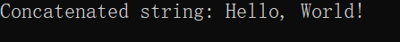

# C常用函数

## 输入输出

### scanf：标准格式输入

- 头文件：

```c
#include <stdio.h>
```

- 函数原型为：

```c
int scanf(const char *format, ...);
```

- 参数入口

  输入参数**`format`**是一个字符串，用于指定输入的格式，而**`...`**表示可以接受任意数量的变量

- 注意：**当`scanf`从缓冲区读取数据时遇到空格和回车键则会认为读取完毕**

- 用例与运行结果

用例1：读取数字

```c
#include <stdio.h>
int main(){
	int num;
	printf("请输入一个整数：");
	scanf("%d", &num);
	printf("您输入的整数是：%d\n", num);
	return 0;
}
```


用例2：读取字符串

```c
#include <stdio.h>
#define MAX_LEN 80
int main(){
	char str[MAX_LEN];
	printf("请输入一串字符串：");
	scanf("%s", str);
	printf("您输入的字符串为：%s\n", str);
	return 0;
}
```


### scanf_s：scanf安全函数版本

- **头文件：**

```c
#include <stdio.h>
```

- **函数原型：**

```c
int scanf_s(const char *format, ...);
```

- **注意事项：**

  **`scanf_s() `**是 **`scanf()`** 的安全版本，**用于避免常见的安全问题（如缓冲区溢出）**。与 **`scanf()`** 类似，它从标准输入中读取数据并根据格式说明符解析数据。

- **与 scanf() 的区别**
  - **安全性**: `scanf_s()` 要求额外提供缓冲区大小信息，以防止缓冲区溢出。这**主要适用于字符串和字符数组的读取**。
  - **附加参数**: 读取字符串和字符时，`scanf_s()` 需要提供附加参数，**指定目标缓冲区的大小**。

- **用例与运行结果**

```c
#include <stdio.h>
#define MAX_LEN 80
int main() {
    char str[MAX_LEN];
    scanf_s("%s", str,(unsigned)sizeof(str));  // 指定缓冲区大小为 5
    printf("You entered: %s\n", str);
    return 0;
}
```


### fgets：直接读取一行

- **头文件：**

```c
# include <stdio.h>
```

- **函数原型为：**

```c
char *fgets(char *s, int size, FILE *stream);
```

`fgets()` 虽然比 `gets()` 安全，但安全是要付出代价的，代价就是它的使用比 `gets()` 要麻烦一点，有三个参数。它的功能是从 `stream 流`中读取 `size` 个字符存储到字符指针变量` s `所指向的内存空间。它的返回值是一个指针，指向字符串中第一个字符的地址。

- **用例与运行结果**

1. 案例1读取一行数据

```c
#include <stdio.h>
#define MAX_LEN 80
int main(){
	char str[MAX_LEN];
	fgets(str, MAX_LEN, stdin);
	printf("%s", str);
    return 0;
}
```


2. 案例2循环读入直至结尾

```c
#include <stdio.h>
#define MAX_LEN 80
int main(){
	char str[MAX_LEN];
	while(*fgets(str, MAX_LEN, stdin) != '\n'){
		printf("%s", str);
	}
	return 0;
}
```


3. 案例3循环读入直至文件结尾

```c
#include <stdio.h>
```

## 字符串分割

#### `strtok`：按某个字符分割字符串

- **函数原型：**

  `char *__cdecl strtok(char *_String, const char *_Delimiter)`

- 解释：

  **`strtok()`函数**接收**两个传入参数**，将**`_String`**中保存的**字符串（待处理字符串）**，按照**`_Delimiter`**中的字符作为**分隔符**进行**分割**。如果**`_String`**为空，则**函数内部**保存的**`SAVE_PTR`指针**在**下一次调用中将作为起始位置**。

- 注意：

  第一个传入参数**`_String`**定义为**`char`**而不是**`const char\*`**，就说明**`strtok()`函数不保证不修改传入数据的内容**。实际上，**第一个参数`_String`传进来的字符串，是会被`strtok()`函数所修改的**，因此调用`strtok()`函数的时候应当注意。

#### `strtok_s`：strtok安全函数版本

- 函数原型：`char *__cdecl strtok_s(char *_String, const char *_Delimiter, char **_Context)`

`strtok_s()`函数增加了一个参数**`_Context`**，这个参数就是**相当于`strtok()`函数中内部定义的静态`SAVE_PTR`指针**，用来传递对字符串`_String`的处理进行到了哪里

- 使用例子：

```c
#include <stdio.h>
#include <string.h>
#define MAX_LEN 80
int main() {
    const char* splitChar = ",";//分割逗号
    char* context = NULL;
    char str[MAX_LEN];
    fgets(str, MAX_LEN, stdin);
    char* ptr = strtok_s(str, splitChar, &context);
    while (ptr != NULL)
    {
        printf("%s\n", ptr);
        ptr = strtok_s(NULL, splitChar, &context);
    }
    printf("strtok after, str:%s\n", str);
    return 0;
}
```


## 字符串复制

### strcpy：将一个字符串的内容拷贝到另一个字符串

- **头文件：**

```c
#include <string.h>
```

- **函数原型：**

```c
char * strcpy ( char * destination, const char * source );
```

- **参数：**

  **`destination`**为目标字符串，**`source`**为源字符串

- **注意：**`strcpy()` 有`bufferOverFlow`风险，会破坏内存。

- **功能：**把从`source`地址开始且含有`\0`结束符的字符串复制到以`destination`开始的地址空间

   **注：**`destination`的空间必须要能够存储**`src`的长度加上`\0`字符**。

- **用例与运行结果：**

1. 用例1：

```c
/* strcpy example */
#include <stdio.h>
#include <string.h>
 
int main()
{
	char str1[] = "Sample string";
	char str2[40]={0};
	printf("str1: %s\nstr2: %s\n", str1, str2);
 
	strcpy(str2, str1);
	printf("str1: %s\nstr2: %s\n", str1, str2);
 
	return 0;
}
```


2. 用例2：

```c
/* strcpy example */
#include <stdio.h>
#include <string.h>
 
int main()
{
	char str1[] = "Sample string";
	char *str2 = (char *)malloc((strlen(str1)+1)*sizeof(char));//注意+1，strlen()不算\0
	printf("str1: %s\nstr2: %s\n", str1, str2);
 
	strcpy(str2, str1);
	printf("str1: %s\nstr2: %s\n", str1, str2);
 
	return 0;
}
```


### strcpy_s：strcpy安全函数版本

- **函数声明：**

```
errno_t strcpy_s(char *strDestination , size_t numberOfElements , const char *strSource);
```

`strcpy_s(char* destination, size_t numElems, const char* source) `

- **注意：**`strcpy_s()`不会有`bufferOverFlow`，但是当源串的长度大于目标缓冲区大小 时，会有提示性错误。

`strcpy_s()` 函数第二个参数，是**设置目标缓冲区大小**，并非原始缓冲区大小。

```c
strcpy_s(dst, sizeof(dst)/sizeof(dst[0]), src); //正确写法
strcpy_s(dst, sizeof(src)/sizeof(src[0]), src);  //错误写法
```

- **用例与运行结果：**

```c
#include <stdio.h>
#include <string.h>

int main()
{
    char src[1024] = { "C/C++教程-strcpy_s函数 - www.codersrc.com" };
    char dst[1024] = { 0 };
    int len_src = sizeof(src)/sizeof(char);
    int len_dst = sizeof(dst) / sizeof(char);
    printf("len_src:%d len_dst:%d\n", len_src,len_dst);
    printf("strcpy_s之前 dst:%s\n", dst);
    strcpy_s(dst, sizeof(dst)/sizeof(dst[0]), src);
    printf("strcpy_s之后 dst:%s\n", dst);
    printf("\n");
    return 0;
}
```


### strncpy：复制n个字符

- **头文件：**

```c
#include <string.h>
```

- **函数原型：**

```c
char *strncpy(char *dest, const char *src, size_t n)
```

- **参数：**
  - `dest`：指向用于存储复制内容的目标数组。
  - `src`： 要复制的字符串。
  - `n`：要从源中复制的字符数。

- **注意：**`strncpy()`函数不会检查目标字符串`dest`的长度，如果`dest`的长度小于`src`的长度，可能会导致缓冲区溢出。

- **用例与运行结果：**

```c
#include <stdio.h>
#include <string.h>

int main(){
	char src[40];
	char dest[12];
	memset(dest, '\0',sizeof(dest));
	strcpy(src, "Hello! Test Case.");
	strncpy(dest, src, 6);
	printf("目标字符为：%s", dest);
	return 0;
}
```


## 字符串拼接

### strcat：字符串拼接

- **头文件：**

```c
#include <string.h>
```

- **函数原型：**

```c
char *strcat(char *dest, const char *src);
```

- **参数与返回值：**
  - `dest`: 目标字符串的指针。
  - `src`: 源字符串的指针。
  - 返回连接后的目标字符串的指针。

- **用例与运行结果：**

```c
#include <stdio.h>
#include <string.h>

int main() {
    char dest[50] = "Hello, ";
    char src[] = "World!";
    
    strcat(dest, src);
    printf("Concatenated string: %s\n", dest);
    
    return 0;
}
```



- **注意：**

1. dest和src字符串必须’\0’结束

2. 目标空间必须可修改（前面不能加const并且不能说常量字符串）

3. dest最后的结束字符’\0’会被覆盖掉，并在连接后的字符串的尾部再增加一个’\0’

4. **dest与src所指的内存空间不能重叠**

5. **dest要有足够的空间**来容纳要复制的字符串。

6. **字符串不可以连接字符串本身**：自己连接自己就会覆盖\0，这样就**会死循环**

### strcat_s：strcat安全函数版本

- **函数原型：**

```c
errno_t strcat_s(char *strDestination, size_t numberOfElements, const char *strSource);
```

- **参数：**
  - `strDestination` -- 目标字符串缓冲区
  - `numberOfElements` -- 源字符串追加到目标字符串缓冲区后的总大小，单位字节
  - `strSource` -- 源字符串缓冲区 
  - 返回值：
    - `0`：成功
    - `EINVAL`：目标字符串或者源字符串没有初始化
    - `ERANGE`：越界

- **用例与运行结果：**

```c
#include <iostream>
#include <cstring>
#define MAXLEN 80
int main() {
	_CrtSetReportMode(_CRT_ERROR, 0);
	char str1[MAXLEN] = "Hello,";
	char str2[] = "world";
	printf("Before strcat, str1 is %s, str2 is %s\n", str1, str2);
	int num = strlen(str1) + strlen(str2) + 1;
	errno_t rlt = strcat_s(str1, num, str2);
	if (rlt == 0)
		printf("After strcat, str1 is %s, str2 is %s\n", str1, str2);
	if (rlt == EINVAL)
		printf("No initialize!\n");
	if (rlt == ERANGE)
		printf("Dest's size is small!\n", str1, str2);
	return 0;
}
```


### strncat：拼接几个字符

- **函数功能：**

  将源字符串的前n个字符加到目标字符串后

- **头文件：**

```c
#include <string.h>
```

- **函数原型：**

```c
char* strncat(char* dest, const char* src, int num)
```

- **注意：**

1. **`strcat()`**本质上是**把目标字符串的’\0’与源字符串的元素交换**实现的，当**连接的是自己的时候，就会陷入死循环**，那么这时只能使用`strncat()`函数了
2. 建议：**建议采用`strncat()`**，因为不会出现上述的陷入死循环的可能，并且`strncat()`有一个不可或缺的优势，就是能够自由控制要增加的字符个数
3. `strncat()`函数在追加字符时，不会检查目标字符串`dest`的长度，如果`dest`的长度小于`src`的长度，可能会导致缓冲区溢出。

- **用例与运行结果：**

```c
#include <stdio.h>
#include <string.h>

int main(){
	char str1[100] = "Hello,";
	char str2[100] = "world!Hello, everyone!";
	strncat(str1, str2, 6);
	printf("%s\n", str1);
    printf("%s\n", str2);
	return 0;
}
```


